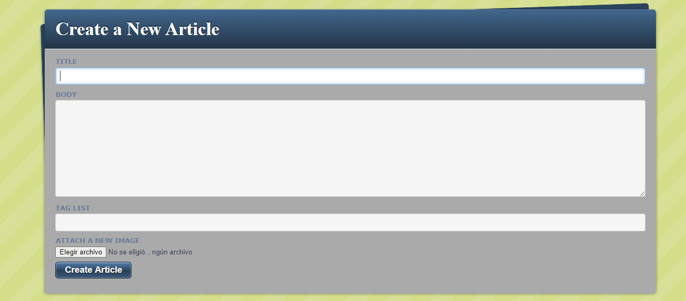
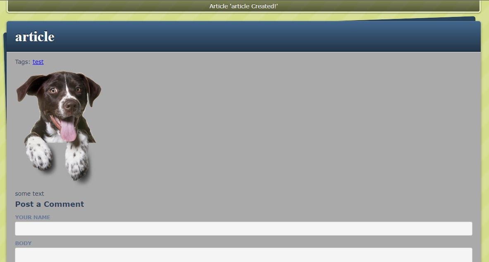

# [BLOG]

- In this project we created a simple blog system to learn the basics of Ruby on Rails including:

Models, Views, and Controllers (MVC)
Data Structures & Relationships
Routing
Migrations
Views with forms, partials, and helpers
RESTful design
Adding gems for extra features

 
## Setup

- Make a copy in your local enviroment(Clone the Git Repository)

## Blog preview

## Built With

- Ruby on Rails
- Rubocop

## Prerequisites

- Browser (Google Chrome, Mozilla Firefox, Safari or any other browser)
- Ruby on Rails

## GitHub Repo

-  https://github.com/Rocio01/blogger

## Author

👤 **Mohamed Sabry**

- Github: [@mohamedSabry0](https://github.com/mohamedSabry0)
- Twitter: 
- Linkedin: 

👤 **Rocio Martinez**

- Github: [@Rocio01](https://github.com/Rocio01)
- Twitter: [@rugiada8801](https://twitter.com/rugiada8801)
- Linkedin: [zulma-rocio-martinez](https://www.linkedin.com/in/zulma-rocio-martinez)

## Show your support

Give a ⭐️ if you like this project!

## Acknowledgments

- Microverse
- Ruby on Rails
- The Odin project
- http://tutorials.jumpstartlab.com

